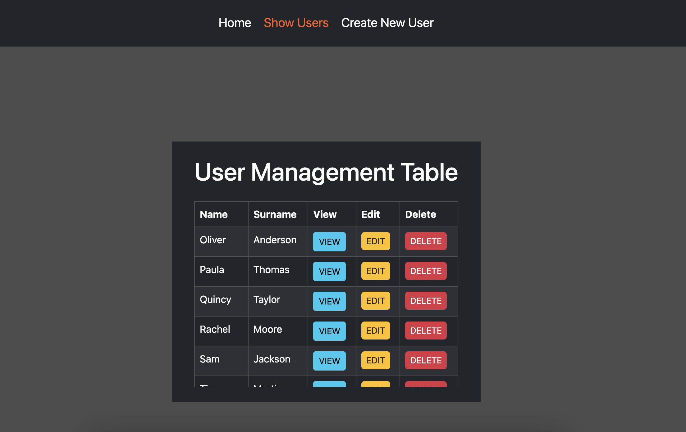

## Prior to commencing any endeavors, it is imperative to secure a dependable and stable internet connection for the successful execution of this distinguished project. 

## Github repo: https://github.com/FLM080/web-assignment3

 Things to install:
    1. npm install
    2. npm install express
    3. npm install ejs

 Write into the terminal:
    node app.js and click on the link starting at http:

 The first page is the index page.

 If you click on the show users link in the navbar, it will take you to the list of users. 
 
The users list has the list of users and three buttons:
buttons:
1. view: 
    this will show the individual user information

2. edit:
    this will show the individual user edit form
    here you can change the name and surname of an individual user
    if you click on accept the information of that user will change
    after that it will take you to the view user page

3. delete:
    this will delete the user

Click the 'Create New User' link in the navbar it will take you to the create new user form
There you can write a name and surname for a new user, this generates an ID for your new user.
Then you click on accept and it will update the list of users with the new user
